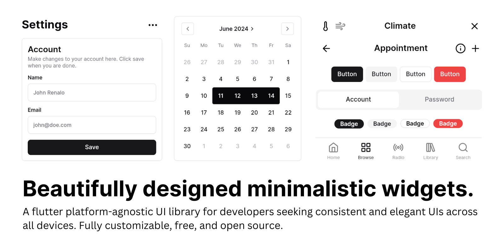

<a href="https://forui.dev">
  <h1 align="center">
    <picture>
      <source width="400" media="(prefers-color-scheme: dark)" srcset="docs/public/logos/dark_logo.png">
      
    </picture>
  </h1>
</a>

<p align="center">
  <a href="https://github.com/duobaseio/forui/actions/workflows/forui_build.yaml"></a>
  <a href="https://codecov.io/gh/duobaseio/forui" ></a>
  <a href="https://pub.dev/packages/forui"></a>
  <a href="https://github.com/duobaseio/forui"></a>
  <a href="https://discord.gg/jrw3qHksjE"></a>
</p>

<p align="center">
  <a href="https://forui.dev/docs">📚 Documentation</a> •
  <a href="https://forui.dev/docs/layout/divider">🖼️ Widgets</a> •
  <a href="https://pub.dev/documentation/forui">🤓 API Reference</a> •
  <a href="https://github.com/orgs/duobaseio/projects/4">🗺️ Road Map</a>
</p>

<p align="center">
  Forui is a Flutter UI library that provides a set of beautifully designed, minimalistic widgets.
</p>

<br />
<div align="center">
 
</div>

> [!IMPORTANT]
> Forui 0.15.0+ requires Flutter **3.35.0+**. Run `flutter --version` to check your Flutter version.

## Why Choose Forui?

* 🎨 Over 40+ beautifully crafted widgets.
* ⚡ Bundled [CLI](https://forui.dev/docs/themes#customize-themes) to generate themes & styling boilerplate.
* ✅ [Well-tested](https://app.codecov.io/gh/duobaseio/forui).
* 🌍 I10n support.
* 🪝 First-class [Flutter Hooks](https://pub.dev/packages/flutter_hooks) integration via [`forui_hooks`](https://pub.dev/packages/forui_hooks).

## Documentation

Visit [forui.dev/docs](https://forui.dev/docs) to view the documentation.

## Flutter Hooks Integration

<a href="https://github.com/duobaseio/forui/actions/workflows/forui_hooks_build.yaml"></a>
<a href="https://pub.dev/packages/forui_hooks"></a>

Forui provides first class integration with [Flutter Hooks](https://pub.dev/packages/flutter_hooks). All controllers
are exposed as hooks in the companion `forui_hooks` package.

## Contributing

Please read the [contributing guide](/CONTRIBUTING.md).

## Nightly Builds

Nightly builds are available on the `nightly` branch. To use the latest nightly build, add the following to your `pubspec.yaml`:

```yaml
dependencies:
  forui:
    git:
      url: https://github.com/duobaseio/forui.git
      ref: nightly
      path: forui
```

Nightly builds are not guaranteed to be stable. Use at your own risk.


## License

Code is licensed under the [MIT License](LICENSE). Fonts are licensed under [Open Font License](LICENSE). Icons are licensed under [ISC License](https://github.com/duobaseio/forui/blob/main/LICENSE).
