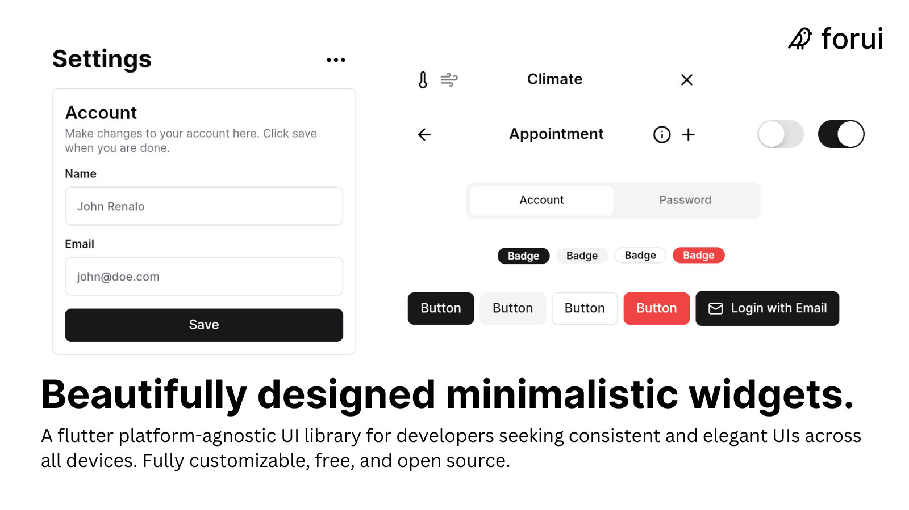

<a href="https://forui.dev">
  <h1 align="center">
    <picture>
      <source width="400" media="(prefers-color-scheme: dark)" srcset="docs/public/dark_logo.png">
      
    </picture>
  </h1>
</a>

  
  
  
  

**Forui** is a UI library for Flutter that provides a set of minimalistic widgets heavily inspired by [shadcn/ui](https://ui.shadcn.com/).

 

 

## Documentation

Visit [forui.dev/docs](https://forui.dev/docs) to view the documentation.

## Contributing

Please read the [contributing guide](/CONTRIBUTING.md).

## License

Licensed under the [MIT license](/LICENSE.md).
