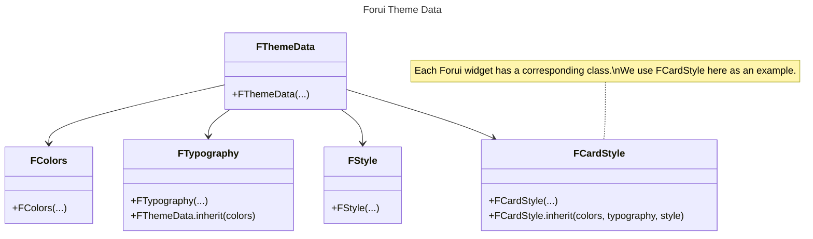

import {Callout} from "nextra/components";

export function Theme({title, color}) {
    return (
        <div className="flex items-center space-x-2">
            <div className="h-4 w-4 rounded-full" style={{backgroundColor: color}}/>
            <p className="font-medium">{title}</p>
        </div>
    );
}


# Themes

Forui themes allows you to customize the look and feel of your Flutter application.
Our theming solution is designed to help you get started quickly while offering powerful and flexible customization options.


## Predefined Themes

<Callout type="info">
    Forui does not manage the theme brightness (light or dark) automatically.
    You need to specify the theme explicitly in `FTheme(...)`.

    ```dart filename="main.dart" {3} copy
    @override
    Widget build(BuildContext context) => FTheme(
          data: FThemes.zinc.light, // or FThemes.zinc.dark
          child: const FScaffold(...),
        );
    ```
</Callout>

Forui provides a set of predefined themes that you can use out of the box.
The color schemes are heavily inspired by [shadcn/ui themes](https://ui.shadcn.com/themes).

| Theme                                    | Light Accessor         | Dark Accessor         |
|:-----------------------------------------|:-----------------------|:----------------------|
| <Theme title="Zinc" color="#18181b" />   | `FThemes.zinc.light`   | `FThemes.zinc.dark`   |
| <Theme title="Slate" color="#64748b" />  | `FThemes.slate.light`  | `FThemes.slate.dark`  |
| <Theme title="Red" color="#dc2626" />    | `FThemes.red.light`    | `FThemes.red.dark`    |
| <Theme title="Rose" color="#e11d48" />   | `FThemes.rose.light`   | `FThemes.rose.dark`   |
| <Theme title="Orange" color="#f97316" /> | `FThemes.orange.light` | `FThemes.orange.dark` |
| <Theme title="Green" color="#16a34a" />  | `FThemes.green.light`  | `FThemes.green.dark`  |
| <Theme title="Blue" color="#2563eb" />   | `FThemes.blue.light`   | `FThemes.blue.dark`   |
| <Theme title="Yellow" color="#facc15" /> | `FThemes.yellow.light` | `FThemes.yellow.dark` |
| <Theme title="Violet" color="#7c3aed" /> | `FThemes.violet.light` | `FThemes.violet.dark` |


## Usage

[`FTheme`](https://pub.dev/documentation/forui/latest/forui.theme/FTheme-class.html) uses inherited widgets to provide the
[`FThemeData`](https://pub.dev/documentation/forui/latest/forui.theme/FThemeData-class.html) to all widgets in the subtree.
Forui provides an extension on `BuildContext` which allows for direct access to `FThemeData` through `context.theme`.

```dart {3-6} copy
@override
Widget build(BuildContext context) {
  final theme = context.theme; // FThemeData
  final colors = context.theme.colors; // FColors
  final typography = context.theme.typography; // FTypography
  final style = context.theme.style; // FStyle

  return const Placeholder();
}
```

A high level overview of the theme data structure is as follows:
- [**`FThemeData`**](https://pub.dev/documentation/forui/latest/forui.theme/FThemeData-class.html) contains `FColors`, `FTypography`, `FStyle`, and widget styles (eg. `FCardStyle`).
- [**`FColors`**](https://pub.dev/documentation/forui/latest/forui.theme/FColors-class.html) contains the color scheme (eg. `background`, `foreground`, and `primary`).
- [**`FTypography`**](https://pub.dev/documentation/forui/latest/forui.theme/FTypography-class.html) contains the `defaultFontFamily` and various `TextStyle`s.
- [**`FStyle`**](https://pub.dev/documentation/forui/latest/forui.theme/FStyle-class.html) contains other miscellaneous styling options (eg. `borderRadius`).

A more detailed explanation of each class can be found in the [Class Diagram](#class-diagram) section.


## Customize Themes

### CLI

It's recommended to use the [CLI](cli) to generate themes and styles in your project. These themes and styles can be
directly modified to fit your design needs.

This example demonstrates how to generate and use both a theme and `FDividerStyles` in your project.

In your project directory run:
```shell copy
dart run forui init
```

To generate a `FDivider`'s styles:
```shell copy
dart run forui style create fdivider
```

This will generate:
```dart filename="lib/theme/divider_styles.dart" copy
FDividerStyles dividerStyles({
  required FColors colors,
  required FStyle style,
}) => FDividerStyles( // Modify these styles to fit your design needs.
  horizontalStyle: FDividerStyle(
    color: colors.secondary,
    padding: FDividerStyle.defaultPadding.horizontalStyle,
    width: style.borderWidth,
  ),
  verticalStyle: FDividerStyle(
    color: colors.secondary,
    padding: FDividerStyle.defaultPadding.verticalStyle,
    width: style.borderWidth,
  ),
);
```

To generate a theme based on [zinc](#predefined-themes):
```shell copy
dart run forui theme create zinc
```

This will generate a theme which you can add the generated divider styles to:
```dart filename="lib/theme/theme.dart" {1, 19, 39} copy
import 'divider_styles.dart';

FThemeData get zincLight {
  const colors = FColors(
    brightness: Brightness.light,
    background: Color(0xFFFFFFFF),
    foreground: Color(0xFF09090B),
    ...
  );

  final typography = _typography(colors: colors);
  final style = _style(colors: colors, typography: typography);

  return FThemeData(
    colors: colors,
    typography: typography,
    style: style,
    // Add your previously generated divider styles and other generated styles here.
    dividerStyles: dividerStyles(colors: colors, style: style),
  );
}

FThemeData get zincDark {
  const colors = FColors(
    brightness: Brightness.dark,
    background: Color(0xFF09090B),
    foreground: Color(0xFFFAFAFA),
    ...
  );

  final typography = _typography(colors: colors);
  final style = _style(colors: colors, typography: typography);

  return FThemeData(
    colors: colors,
    typography: typography,
    style: style,
    // Add your previously generated divider styles and other generated styles here.
    dividerStyles: dividerStyles(colors: colors, style: style),
  );
}

FTypography _typography({
  required FColors colors,
  String defaultFontFamily = 'packages/forui/Inter',
}) => FTypography(
  xs: TextStyle(
    color: colors.foreground,
    fontFamily: defaultFontFamily,
    fontSize: 12,
    height: 1,
  ),
  sm: TextStyle(
    color: colors.foreground,
    fontFamily: defaultFontFamily,
    fontSize: 14,
    height: 1.25,
  ),
  ...
);

FStyle _style({required FColors colors, required FTypography typography}) =>
    FStyle(
      enabledFormFieldStyle: FFormFieldStyle.inherit(
        labelColor: colors.primary,
        descriptionColor: colors.mutedForeground,
        typography: typography,
      ),
      disabledFormFieldStyle: FFormFieldStyle.inherit(
        labelColor: colors.disable(colors.primary),
        descriptionColor: colors.disable(colors.mutedForeground),
        typography: typography,
      ),
      ...
    );
```

The first command, `dart forui init` generates a main file which you can add the generated theme to:
```dart filename="lib/main.dart" {1, 13} copy
import 'theme/theme.dart';

void main() {
  runApp(const Application());
}

class Application extends StatelessWidget {
  const Application({super.key});

  @override
  Widget build(BuildContext context) {
    // Assign the generated theme to `theme`.
    final theme = zincLight;

    return MaterialApp(
      localizationsDelegates: FLocalizations.localizationsDelegates,
      supportedLocales: FLocalizations.supportedLocales,
      builder: (_, child) => FTheme(data: theme, child: child!),
      theme: theme.toApproximateMaterialTheme(),
      // You can replace FScaffold with Material's Scaffold.
      home: const FScaffold(
        // TODO: replace with your widget.
        child: Example(),
      ),
    );
  }
}

class Example extends StatefulWidget {
  const Example({super.key});

  @override
  State<Example> createState() => _ExampleState();
}

class _ExampleState extends State<Example> {
  int _count = 0;

  @override
  Widget build(BuildContext context) => Center(
    child: ...
  );
}
```

## Class Diagram



### Colors

The `Colors` class contains the color scheme for the theme.
This usually consist of a set of colors with its corresponding foreground color (eg. `primary` and `primaryForeground`).

In most cases, the color will be used as the background color, and the foreground color will be used as the text/icon color.

```dart {3, 6-14} copy
@override
Widget build(BuildContext context) {
  final colors = context.theme.colors;
  final typography = context.theme.typography;

  return ColoredBox(
    color: colors.primary,
    child: Text(
      'Hello World!',
      style: typography.xs.copyWith(
          color: colors.primaryForeground
      ),
    ),
  );
}
```

#### Hovered and Disabled Colors

Hovered and disabled colors are derived by adjusting the opacity. To derive these colors, use the `FColors.hover`
and `FColors.disable` methods. The opacity can be adjusted with `FColors.enabledHoveredOpacity` and
`FColors.disabledOpacity`.

### Typography

The `FTypography` class contains the typography settings for the theme.
This includes the default font family and various `TextStyle`s for different use cases.

<Callout type="info">
    The `TextStyle`s stored in `FTypography` are based on [Tailwind CSS Font Size](https://tailwindcss.com/docs/font-size).
    For instance, `FTypography.sm` is closely related to `text-sm` in Tailwind CSS.
</Callout>

It is recommended to use the `copyWith(...)` to apply colors and other styles as the `TextStyle`s stored only contain the `fontSize` and `height` properties.

```dart {4, 8-12} copy
@override
Widget build(BuildContext context) {
  final colors = context.theme.colors;
  final typography = context.theme.typography;

  return Text(
    'Hello World!',
    style: typography.xs.copyWith(
      color: colors.primaryForeground,
      fontWeight: FontWeight.bold,
      fontStyle: FontStyle.italic,
    ),
  );
}
```


#### Custom Font Family

To change the default font family, use the `copyWith(...)` method to apply the new font family.
As some fonts may have different sizes, the `scale(...)` method is provided to quickly scale all the font sizes.

```dart filename="main.dart" {4-6} copy
@override
Widget build(BuildContext context) => FTheme(
      data: FThemes.zinc.light.copyWith(
        typography: FThemes.zinc.light.typography.copyWith(
          defaultFontFamily: 'Roboto',
        ).scale(sizeScalar: 0.8),
      ),
      child: const FScaffold(...),
    );
```


### Style

The `FStyle` class contains other miscellaneous styling options for the theme.

```dart {4, 7-14} copy
@override
Widget build(BuildContext context) {
  final colors = context.theme.colors;
  final style = context.theme.style;

  return DecoratedBox(
    decoration: BoxDecoration(
      border: Border.all(
        color: colors.border,
        width: style.borderWidth,
      ),
      borderRadius: style.borderRadius,
      color: colors.primary,
    ),
    child: const Placeholder(),
  );
}
```


## Override Individual Widgets

In certain cases, you may want to override the theme for a specific widget.
This can be easily achieved by using the `style(...)` parameter.

<Callout type="info">
    In the example below, styles are only overridden for this specific `FCard` widget.
    `FCard` widgets that are used elsewhere will still inherit from theme data.
</Callout>

```dart filename="main.dart" {8-12} copy
@override
Widget build(BuildContext context) {
  final theme = context.theme;

  return FCard(
    title: 'Notification',
    subtitle: 'You have 3 new messages',
    style: theme.cardStyle.copyWith(
      decoration: theme.cardStyle.decoration.copyWith(
        borderRadius: BorderRadius.zero, // Remove border radius.
      ),
    ),
  );
}
```


## Material Design Interoperability

Forui provides a way to convert its themes to Material Design's `ThemeData` for interoperability between Forui and Material widgets. This is useful when:

- Using Material widgets within a Forui application
- Maintaining consistent theming across both Forui and Material components
- Gradually migrating from Material Design to Forui

<Callout type="warning">
  The `toApproximateMaterialTheme()` method is marked as experimental. As an experimental feature, this method can change without prior warning.
  The mapping between Forui and Material themes is done on a best-effort basis, and may not perfectly capture all the nuances of a Forui theme.
</Callout>


### Usage

A Forui theme can be converted to a Material theme using the
[`toApproximateMaterialTheme()`](https://pub.dev/documentation/forui/latest/forui.theme/FThemeData/toApproximateMaterialTheme.html)
method.

```dart {9} copy
import 'package:flutter/material.dart';
import 'package:forui/forui.dart';

@override
Widget build(BuildContext context) {
  final fThemeData = FThemes.zinc.light;
  
  return MaterialApp(
    theme: fThemeData.toApproximateMaterialTheme(),
    home: Scaffold(
      body: Center(
        child: FCard(
          title: 'Mixed Widgets',
          subtitle: 'Using both Forui and Material widgets together',
          child: ElevatedButton(
            onPressed: () {},
            child: const Text('Material Button'),
          ),
        ),
      ),
    ),
  );
}
```
