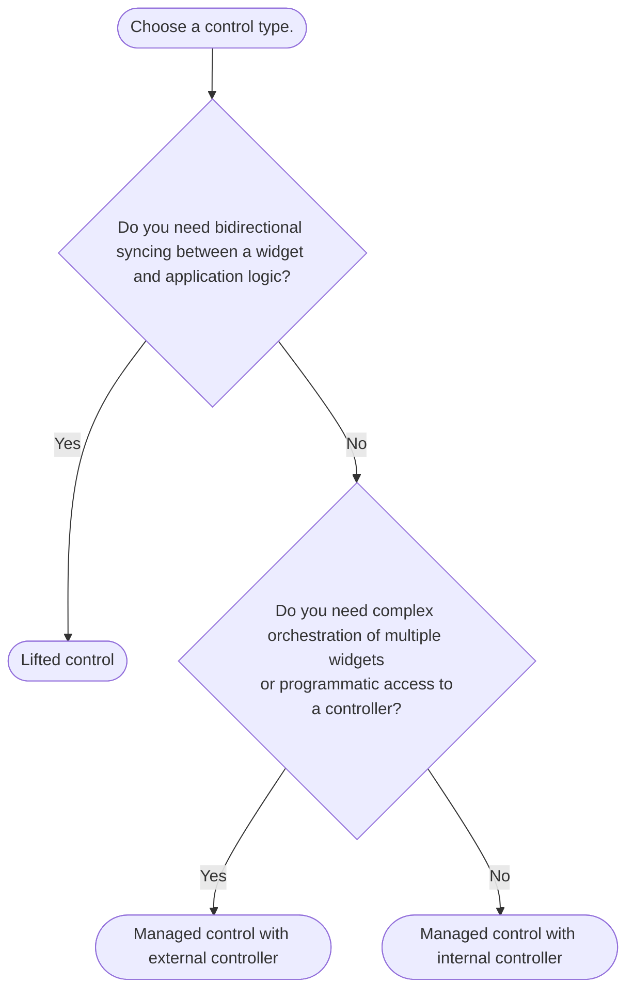

import {Callout} from "fumadocs-ui/components/callout";

Controls are abstractions over controllers, e.g. `TextEditingController`, that define where state lives.
Instead of passing controllers to Forui widgets, you pass controls (that optionally wrap controllers).

There are **2** types of controls.

## Lifted

You externally manage the state. The widget is "dumb" and just reflects the passed-in values. This is similar
to React's [controlled components](https://react.dev/learn/sharing-state-between-components#controlled-and-uncontrolled-components).

```dart
FPopover(
  control: .lifted(
    shown: _shown,
    onChange: (shown) => setState(() => _shown = shown),
  ),
);
```

## Managed

The widget internally manages its own state, either through an internal controller configured using the passed-in initial
values, or through a passed-in external controller. In the latter case, you are responsible for managing the controller's
lifecycle.

```dart
// FPopover manages its own state using an internal controller.
FPopover(control: .managed(initial: false, onChange: print));

// FPopover manages its own state using an external controller.
FPopover(control: .managed(controller: _externalController));
```


## When to Use Which?

<Callout type="info">
    **TL;DR**: Start with "Managed with internal controller" for simplicity and switch as needed.
</Callout>



### Common scenarios
* Lifted:
  * Syncing state between your state management solution, e.g. [Riverpod](https://riverpod.dev/), and the widget.
  * Reacting to every state change and potentially modifying the state.

* Managed with external controller:
  * Using a lifecycle management solution, e.g. [Flutter Hooks](https://pub.dev/packages/flutter_hooks).
  * Programmatically triggering actions, e.g. showing a popover.

* Managed with internal controller:
  * Prototyping.
  * Simply setting an initial value.
  * Passively observing state changes.


## Custom Controllers

Suppose you extend a controller, e.g. `FPopoverController`, to add custom logic. You have **2** options when passing the
custom controller to a widget.

### Managed Control with External Controller

Pass the custom controller via a managed control.

```dart
class CustomController extends FPopoverController {
  // Custom logic here.
}

class MyWidget extends StatefulWidget {
  const MyWidget({super.key});

  @override
  State<MyWidget> createState() => _MyWidgetState();
}

class _MyWidgetState extends State<MyWidget> with SingleTickerProviderStateMixin {
  late final CustomController _controller;

  @override
  void initState() {
    super.initState();
    _controller = CustomController(vsync: this);
  }

  @override
  void dispose() {
    _controller.dispose();
    super.dispose();
  }

  @override
  Widget build(BuildContext context) => FPopover(
    control: .managed(controller: _controller),
    // ...
  );
}
```

The downside of this approach is that you have to manage the controller's lifecycle yourself.

### Extend Managed Control

Alternatively, you can extend managed control (`FPopoverManagedControl`) to create your custom controller.

```dart
class CustomController extends FPopoverController {
  final int customValue;

  CustomController({required this.customValue, required super.vsync});
}

class CustomManagedControl extends FPopoverManagedControl {
  final int customValue;

  CustomManagedControl({required this.customValue});

  @override
  CustomController createController(TickerProvider vsync) => CustomController(
    customValue: customValue,
    vsync: vsync,
  );
}

// Usage:
FPopover(control: CustomManagedControl(customValue: 42));
```

This way, the widget manages the controller's lifecycle for you.