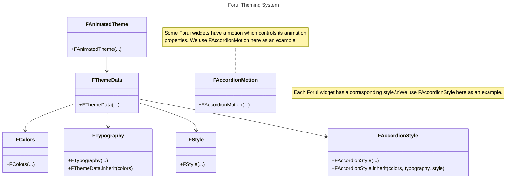

import {Callout} from "fumadocs-ui/components/callout";
export function Theme({title, color}) {
    return (
        <div className="flex items-center space-x-2">
            <div className="h-4 w-4 rounded-full" style={{backgroundColor: color}}/>
            <p className="font-medium">{title}</p>
        </div>
    );
}

Forui themes allow you to define a consistent visual style across your application & widgets. It relies on the [CLI](cli)
to generate themes and styles that can be directly modified in your project.

## Getting Started

<Callout type="info" title="Theme Brightness">
    Forui does not manage the theme brightness (light or dark) automatically.
    You need to specify the theme explicitly in `FAnimatedTheme(...)`.

    ```dart filename="main.dart" {3} copy
    @override
    Widget build(BuildContext context) => FAnimatedTheme(
      data: FThemes.zinc.light, // or FThemes.zinc.dark
      child: FScaffold(...),
    );
    ```
</Callout>

Forui includes predefined themes that can be used out of the box. They are heavily inspired by [shadcn/ui](https://ui.shadcn.com/themes).

| Theme                                    | Light Accessor         | Dark Accessor         |
|:-----------------------------------------|:-----------------------|:----------------------|
| <Theme title="Zinc" color="#18181b" />   | `FThemes.zinc.light`   | `FThemes.zinc.dark`   |
| <Theme title="Slate" color="#64748b" />  | `FThemes.slate.light`  | `FThemes.slate.dark`  |
| <Theme title="Red" color="#dc2626" />    | `FThemes.red.light`    | `FThemes.red.dark`    |
| <Theme title="Rose" color="#e11d48" />   | `FThemes.rose.light`   | `FThemes.rose.dark`   |
| <Theme title="Orange" color="#f97316" /> | `FThemes.orange.light` | `FThemes.orange.dark` |
| <Theme title="Green" color="#16a34a" />  | `FThemes.green.light`  | `FThemes.green.dark`  |
| <Theme title="Blue" color="#2563eb" />   | `FThemes.blue.light`   | `FThemes.blue.dark`   |
| <Theme title="Yellow" color="#facc15" /> | `FThemes.yellow.light` | `FThemes.yellow.dark` |
| <Theme title="Violet" color="#7c3aed" /> | `FThemes.violet.light` | `FThemes.violet.dark` |

## Theme Components



There are **6** core components in Forui's theming system.

- **[`FAnimatedTheme`](https://pub.dev/documentation/forui/latest/forui.theme/FAnimatedTheme-class.html)**: The root widget that provides the theme data to all widgets in the subtree.
- **[`FThemeData`](https://pub.dev/documentation/forui/latest/forui.theme/FThemeData-class.html)**: Main class that holds:
  - **[`FColors`](https://pub.dev/documentation/forui/latest/forui.theme/FColors-class.html)**: Color scheme including primary, foreground, and background colors.
  - **[`FTypography`](https://pub.dev/documentation/forui/latest/forui.theme/FTypography-class.html)**: Typography settings including font family and text styles.
  - **[`FStyle`](https://pub.dev/documentation/forui/latest/forui.theme/FStyle-class.html)**: Misc. options such as border radius and icon size.
  - Individual widget styles.
  - Individual widget motions.

The included `BuildContext` extension allows `FThemeData` can be accessed via [`context.theme`](https://pub.dev/documentation/forui/latest/forui.theme/FThemeBuildContext.html):

```dart {3-6} copy
@override
Widget build(BuildContext context) {
  final FThemeData theme = context.theme;
  final FColors colors = context.theme.colors;
  final FTypography typography = context.theme.typography;
  final FStyle style = context.theme.style;

  return const Placeholder();
}
```

### Colors

The `FColors` class contains the theme's color scheme. Colors come in **pairs** - a main color and its corresponding
foreground color for text and icons.

For example:

- `primary` (background) + `primaryForeground` (text/icons)
- `secondary` (background) + `secondaryForeground` (text/icons)
- `destructive` (background) + `destructiveForeground` (text/icons)

```dart {3, 8} copy
@override
Widget build(BuildContext context) {
  final colors = context.theme.colors;
  return ColoredBox(
    color: colors.primary,
    child: Text(
      'Hello World!',
      style: TextStyle(color: colors.primaryForeground),
    ),
  );
}
```

#### Hovered and Disabled Colors

To create hovered and disabled color variants, use the [`FColors.hover`](https://pub.dev/documentation/forui/latest/forui.theme/FColors/hover.html)
and [`FColors.disable`](https://pub.dev/documentation/forui/latest/forui.theme/FColors/disable.html) methods.

### Typography

The `FTypography` class contains the theme's typography settings, including the default font family and various text
styles.

<Callout type="info">
    The `TextStyle`s in `FTypography` are based on [Tailwind CSS Font Size](https://tailwindcss.com/docs/font-size).
    For example, `FTypography.sm` is the equivalent of `text-sm` in Tailwind CSS.
</Callout>

`FTypography`'s text styles only specify `fontSize` and `height`. Use `copyWith()` to add colors and other properties:

```dart {3, 7-10} copy
@override
Widget build(BuildContext context) {
  final typography = context.theme.typography;

  return Text(
    'Hello World!',
    style: typography.xs.copyWith(
      color: context.theme.colors.primaryForeground,
      fontWeight: FontWeight.bold,
    ),
  );
}
```

#### Custom Font Family

Use the `copyWith()` method to change the default font family. As some fonts may have different sizes, the `scale()`
method is provided to quickly scale all the font sizes.

```dart {5-7} copy
@override
Widget build(BuildContext context) => FAnimatedTheme(
  data: FThemeData(
    colors: FThemes.zinc.light.colors,
    typography: FThemes.zinc.light.typography.copyWith(
      xs: const TextStyle(fontSize: 12, height: 1),
    ).scale(sizeScalar: 0.8),
  ),
  child: const FScaffold(...),
);
```

### Style

The `FStyle` class the theme's miscellaneous styling options such as the default border radius and icon size.

```dart {4, 7-14} copy
@override
Widget build(BuildContext context) {
  final colors = context.theme.colors;
  final style = context.theme.style;

  return DecoratedBox(
    decoration: BoxDecoration(
      border: Border.all(
        color: colors.border,
        width: style.borderWidth,
      ),
      borderRadius: style.borderRadius,
      color: colors.primary,
    ),
    child: const Placeholder(),
  );
}
```

### `FWidgetStateMap`

[`FWidgetStateMap`](https://pub.dev/documentation/forui/latest/forui.theme/FWidgetStateMap-class.html) lets you define
different values based on [`WidgetState`](https://api.flutter.dev/flutter/widgets/WidgetState.html) combinations such as
`hovered & pressed` and `focused | disabled`.

This is useful for describing how widgets should respond to user interaction.

Each combination is also known as a **constraint**. Constraints are evaluated from top to bottom. The first matching will
be used. In general, more specific constraints should be placed above more general ones.

In the following example, given the states `{hovered, pressed}`, the 1st constraint will **always** match.

```dart
FWidgetStateMap({
  // ❌ Don't declare more general constraints above more specific ones!
  // 1st constraint: applied when the accordion is hovered.
  WidgetState.hovered: typography.base.copyWith(
    fontWeight: FontWeight.w500,
    color: colors.foreground,
    decoration: TextDecoration.underline,
  ),
  // 2nd constraint: applied when the accordion is hovered OR pressed.
  WidgetState.hovered | WidgetState.pressed: typography.base.copyWith(
    fontWeight: FontWeight.w500,
    color: colors.foreground,
    decoration: TextDecoration.underline,
  ),
  // 3rd constraint: This text style is applied when the accordion is NOT hovered OR pressed.
  WidgetState.any: typography.base.copyWith(
    fontWeight: FontWeight.w500,
    color: colors.foreground,
  ),
});
```

Most `FWidgetStateMap` fields only support a subset of states. For example, [`FButtonStyle.decoration`](https://pub.dev/documentation/forui/latest/forui.widgets.button/FButtonStyle/decoration.html)
only supports the disabled, hovered, pressed and focused states. A field's supported states are documented in its [API docs](https://pub.dev/documentation/forui/latest/forui.widgets.button/FButtonStyle/decoration.html).

## Customization

Forui provides **2** ways to customize themes and widget styles.

- [**CLI**](#themes) - major and reusable style changes, such as creating your own design system.
- [**`copyWith(...)`**](#copywith) method - minor and one-off adjustments to existing styles.

### Themes

The following section demonstrates how to use the [CLI](cli) generate a **theme** and **widget style** that you can
directly modify to fit your design needs.

We use [`FAccordionStyle`](https://pub.dev/documentation/forui/latest/forui.widgets.accordion/FAccordionStyle-class.html)
as an example, but the same principles apply to all Forui widgets.

#### Generate `main.dart`

Navigate to your project directory.

Run to generate a `main.dart`:

```shell copy
dart run forui init
```

This generates a `main.dart` file where you will add your generated theme:

```dart filename="lib/main.dart" {1, 13, 18-19} copy
import 'theme/theme.dart';

void main() {
  runApp(const Application());
}

class Application extends StatelessWidget {
  const Application({super.key});

  @override
  Widget build(BuildContext context) {
    // Assign the generated theme to `theme`.
    final theme = zincLight;

    return MaterialApp(
      localizationsDelegates: FLocalizations.localizationsDelegates,
      supportedLocales: FLocalizations.supportedLocales,
      builder: (_, child) => FAnimatedTheme(data: theme, child: child!),
      theme: theme.toApproximateMaterialTheme(),
      home: const FScaffold(
        // TODO: replace with your widget.
        child: Placeholder(),
      ),
    );
  }
}
```

#### Generate a Theme

Run to generate a theme based on [zinc](#getting-started)'s light variant:

```shell copy
dart run forui theme create zinc-light
```

<Callout type="info">
    Tip: Run `dart run forui theme ls` to see all available themes.
</Callout>

This generates a theme file which you can:

- add to your generated `main.dart`.
- add the generated styles to.

```dart filename="lib/theme/theme.dart" {1, 20} copy
import 'accordion_style.dart';

FThemeData get zincLight {
  const colors = FColors(
    brightness: Brightness.light,
    barrier: Color(0x33000000),
    background: Color(0xFFFFFFFF),
    foreground: Color(0xFF09090B),
    ...
  );

  final typography = _typography(colors: colors);
  final style = _style(colors: colors, typography: typography);

  return FThemeData(
    colors: colors,
    typography: typography,
    style: style,
    // Add your generated styles here.
    accordionStyle: accordionStyle(colors: colors, typography, typography, style: style),
  );
}

FTypography _typography({
  required FColors colors,
  String defaultFontFamily = 'packages/forui/Inter',
}) => FTypography(
  xs: TextStyle(
    color: colors.foreground,
    fontFamily: defaultFontFamily,
    fontSize: 12,
    height: 1,
  ),
  sm: TextStyle(
    color: colors.foreground,
    fontFamily: defaultFontFamily,
    fontSize: 14,
    height: 1.25,
  ),
  ...
);

FStyle _style({required FColors colors, required FTypography typography}) => FStyle(
  formFieldStyle: FFormFieldStyle.inherit(
    colors: colors,
    typography: typography,
  ),
  focusedOutlineStyle: FFocusedOutlineStyle(
    color: colors.primary,
    borderRadius: const BorderRadius.all(Radius.circular(8)),
  ),
  iconStyle: IconThemeData(color: colors.primary, size: 20),
  tappableStyle: FTappableStyle(),
  ...
);
```

#### Generate a Style

Run to generate a [`FAccordionStyle`](https://pub.dev/documentation/forui/latest/forui.widgets.accordion/FAccordionStyle-class.html):

```shell copy
dart run forui style create accordion
```

<Callout type="info">
    Tip: Run `dart run forui style ls` to see all available styles.
</Callout>

This generates a accordion style file which you can add to your theme:

```dart filename="lib/theme/accordion_style.dart" {8-12} copy
FAccordionStyle accordionStyle({
  required FColors colors,
  required FTypography typography,
  required FStyle style,
}) => FAccordionStyle(
  titleTextStyle: FWidgetStateMap({
    // This text style is applied when the accordion is hovered OR pressed.
    WidgetState.hovered | WidgetState.pressed: typography.base.copyWith(
      fontWeight: FontWeight.w500,
      color: colors.foreground,
      decoration: TextDecoration.underline,
    ),
    // This text style is applied when the accordion is NOT hovered OR pressed.
    WidgetState.any: typography.base.copyWith(
      fontWeight: FontWeight.w500,
      color: colors.foreground,
    ),
  }),
  childTextStyle: typography.sm.copyWith(color: colors.foreground),
  // This decoration is ALWAYS applied.
  iconStyle: FWidgetStateMap.all(
    IconThemeData(color: colors.primary, size: 20),
  ),
  focusedOutlineStyle: style.focusedOutlineStyle,
  dividerStyle: FDividerStyle(color: colors.border, padding: EdgeInsets.zero),
  tappableStyle: style.tappableStyle.copyWith(
    animationTween: FTappableAnimations.none,
  ),
  titlePadding: const EdgeInsets.symmetric(vertical: 15),
  childPadding: const EdgeInsets.only(bottom: 15),
  motion: const FAccordionMotion(),
);
```

See [`FWidgetStateMap`](#fwidgetstatemap) for more information on `FWidgetStateMap`s.

### Individual Widget Styles

You can customize a widget's style in **2** ways:

- Use `copyWith()` - Best for minor adjustments to existing styles.
- Generate via CLI - Best for major style overhauls.

#### `copyWith(...)`

All widgets and style `copyWith(...)`s accept style builder functions.

To change an accordion's focused outline color:

```dart copy
FAccordion(
  style: (style) => style.copyWith(
    focusedOutlineStyle: (style) => style.copyWith(
      color: context.theme.colors.background,
    ),
  ),
);
```

All styles implement the [`call` function](https://dart.dev/language/callable-objects). This allows a style object to be
passed directly to a widget or style's `copyWith(...)` as a shortcut.

Both are equivalent:

```dart copy
// Long-form
FAccordion(
  style: (style) => FAccordionStyle(...),
);

// Short-form
FAccordion(
  style: FAccordionStyle(...),
);
```

#### CLI

The following sections demonstrate how to override an accordion's style.

##### Generate the Style

Run to generate a widget style:

```shell copy
dart run forui style create accordion
```

<Callout type="info">
    Tip: Run `dart run forui style ls` to see all available styles.
</Callout>

##### Modify the Style

This example shows how to add underlining when the accordion title is focused, in addition to the existing hover and press states:

```dart filename="lib/theme/accordion_style.dart" {8} copy
FAccordionStyle accordionStyle({
  required FColors colors,
  required FTypography typography,
  required FStyle style,
}) => FAccordionStyle(
  titleTextStyle: FWidgetStateMap({
    // This text style is applied when the accordion is hovered OR pressed OR focused (new).
    WidgetState.hovered | WidgetState.pressed | Widget.focused: typography.base.copyWith(
      fontWeight: FontWeight.w500,
      color: colors.foreground,
      decoration: TextDecoration.underline,
    ),
    // This text style is applied when the accordion is NOT hovered OR pressed.
    WidgetState.any: typography.base.copyWith(
      fontWeight: FontWeight.w500,
      color: colors.foreground,
    ),
  }),
  ...
);
```

See [`FWidgetStateMap`](#fwidgetstatemap) for more information on `FWidgetStateMap`s.

##### Pass the Style

```dart filename="main.dart" {1, 6-10} copy
import 'lib/theme/accordion_style.dart';

@override
Widget build(BuildContext context) => FAccordion(
  // Pass the modified style to the widget.
  style: accordionStyle(
    colors: context.theme.colors,
    typography: context.theme.typography,
    style: context.theme.style,
  ),
  children: const [
    FAccordionItem(
      title: Text('Is it accessible?'),
      child: Text('Yes. It adheres to the WAI-ARIA design pattern.'),
    ),
  ],
);
```

## Custom Properties

Forui themes can be extended with your own application-specific properties using Flutter's [`ThemeExtension`](https://api.flutter.dev/flutter/material/ThemeExtension-class.html)
system.

### Create a Theme Extension

Theme extensions must extend `ThemeExtension` and implement `copyWith()` and `lerp()`.

```dart filename="lib/theme/brand_color.dart" copy
import 'package:flutter/material.dart';

class BrandColor extends ThemeExtension<BrandColor> {
  final Color color;

  const BrandColor({
    required this.color,
  });

  @override
  BrandColor copyWith({Color? color}) => BrandColor(color: color ?? this.color);

  @override
  BrandColor lerp(BrandColor? other, double t) {
    if (other is! BrandColor) {
      return this;
    }

    return BrandColor(color: Color.lerp(color, other.color, t)!);
  }
}
```

Add the extension to `FThemeData(...)` via its `extensions` parameter:

```dart copy
import 'brand_theme.dart';

FThemeData(
  // ... other theme properties
  extensions: [
    BrandColor(color: const Color(0xFF6366F1)),
  ],
);
```

You can also add extensions to existing themes using `copyWith(...)`:

```dart copy
final theme = FThemes.zinc.light.copyWith(
  extensions: [
    BrandColor(color: const Color(0xFF6366F1)),
  ],
);
```

### Accessing the Properties

Retrieve your custom theme extension via [`extension<T>()`](https://pub.dev/documentation/forui/latest/forui.theme/FThemeData/extension.html):

```dart {3} copy
@override
Widget build(BuildContext context) {
  final brand = context.theme.extension<BrandColor>();
  return ColoredBox(color: brand.color);
}
```

Optionally, we recommend creating a getter on `FThemeData`:

```dart filename="lib/theme/theme_extensions.dart" copy
extension BrandColorExtension on FThemeData {
  BrandColor get brand => extension<BrandColor>();
}
```

## Material Interoperability

Forui provides **2** ways to convert [`FThemeData`](https://pub.dev/documentation/forui/latest/forui.theme/FThemeData-class.html)
to Material's [`ThemeData`](https://api.flutter.dev/flutter/material/ThemeData-class.html).

This is useful when:

- Using Material widgets within a Forui application.
- Maintaining consistent theming across both Forui and Material components.
- Gradually migrating from Material to Forui.

### `toApproximateMaterialTheme()`

A Forui theme can be converted to a Material theme using
[`toApproximateMaterialTheme()`](https://pub.dev/documentation/forui/latest/forui.theme/FThemeData/toApproximateMaterialTheme.html).

<Callout type="warning">
  The `toApproximateMaterialTheme()` method is marked as experimental. This method can change without prior warning. The
  mapping between Forui and Material themes is done on a best-effort basis, and may not perfectly capture all the nuances
  of a Forui theme.
</Callout>

```dart {9} copy
import 'package:flutter/material.dart';
import 'package:forui/forui.dart';

@override
Widget build(BuildContext context) {
  final fThemeData = FThemes.zinc.light;

  return MaterialApp(
    theme: fThemeData.toApproximateMaterialTheme(),
    home: Scaffold(
      body: Center(
        child: FCard(
          title: 'Mixed Widgets',
          subtitle: 'Using both Forui and Material widgets together',
          child: ElevatedButton(
            onPressed: () {},
            child: const Text('Material Button'),
          ),
        ),
      ),
    ),
  );
}
```

### CLI

Use the CLI to generate a copy of `toApproximateMaterialTheme()` inside your project:

```shell copy
dart run forui snippet create material-mapping
```

This should be preferred when you want to fine-tune the mapping between Forui and Material themes, as it allows you to
modify the generated mapping directly to fit your design needs.
