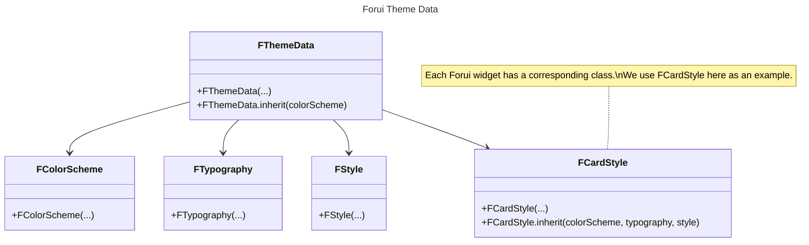

import {Callout} from "nextra/components";

export function Theme({title, color}) {
    return (
        <div className="flex items-center space-x-2">
            <div className="h-4 w-4 rounded-full" style={{backgroundColor: color}}/>
            <p className="font-medium">{title}</p>
        </div>
    );
}

# Themes

Forui themes allows you to customize the look and feel of your Flutter application.
Our theming solution is designed to help you get started quickly while offering powerful and flexible customization options.

## Predefined Themes

<Callout type="info">
    Forui does not manage the theme brightness (light or dark) automatically.
    You need to specify the theme explicitly in `FTheme()`.

    ```dart filename="main.dart" {3}
    @override
    Widget build(BuildContext context) => FTheme(
          data: FThemes.zinc.light, // or FThemes.zinc.dark
          child: const FScaffold(...),
        );
    ```
</Callout>

Forui provides a set of predefined themes that you can use out of the box.
The color schemes are heavily inspired by [shadcn/ui themes](https://ui.shadcn.com/themes).

| Theme                                    | Light Accessor         | Dark Accessor         |
|:-----------------------------------------|:-----------------------|:----------------------|
| <Theme title="Zinc" color="#18181b" />   | `FThemes.zinc.light`   | `FThemes.zinc.dark`   |
| <Theme title="Slate" color="#64748b" />  | `FThemes.slate.light`  | `FThemes.slate.dark`  |
| <Theme title="Red" color="#dc2626" />    | `FThemes.red.light`    | `FThemes.red.dark`    |
| <Theme title="Rose" color="#e11d48" />   | `FThemes.rose.light`   | `FThemes.rose.dark`   |
| <Theme title="Orange" color="#f97316" /> | `FThemes.orange.light` | `FThemes.orange.dark` |
| <Theme title="Green" color="#16a34a" />  | `FThemes.green.light`  | `FThemes.green.dark`  |
| <Theme title="Blue" color="#2563eb" />   | `FThemes.blue.light`   | `FThemes.blue.dark`   |
| <Theme title="Yellow" color="#facc15" /> | `FThemes.yellow.light` | `FThemes.yellow.dark` |
| <Theme title="Violet" color="#7c3aed" /> | `FThemes.violet.light` | `FThemes.violet.dark` |

## Usage

## Customize Themes

It's recommended to use the predefined themes as a starting point and customize them with the `copyWith(...)` method to suit your needs.

```dart filename="main.dart" {3-4, 8, 11, 14}
@override
Widget build(BuildContext context) => FTheme(
      data: FThemes.zinc.light.copyWith(
        colorScheme: FThemes.zinc.light.colorScheme.copyWith(
          primary: const Color(0xFF0D47A1), // dark blue
          primaryForeground: const Color(0xFFFFFFFF), // white
        ),
        typography: FThemes.zinc.light.typography.copyWith(
          defaultFontFamily: 'Roboto',
        ).scale(2),
        style: FThemes.zinc.light.style.copyWith(
          borderRadius: BorderRadius.zero,
        ),
        cardStyle: FThemes.zinc.light.cardStyle.copyWith(
          decoration: FThemes.zinc.light.cardStyle.decoration.copyWith(
            borderRadius: const BorderRadius.all(Radius.circular(8)),
          ),
        ),
      ),
      child: const FScaffold(...),
    );
```

The example above uses `FThemes.zinc.light` theme as a starting point and customizes the following:

- Update the `primary` and `primaryForeground` colors.
- Change the default font family to `Roboto`.
- Remove the `borderRadius` through the style.
- Although we removed the `borderRadius` for all widgets, override the `borderRadius` to `8` for the `FCard()` widget.

While the example may seem overwhelming, most use cases will only require customizations to the `FColorScheme`, `FTypography`, and `FStyle` class.
Sensible defaults for each Forui widget will be automatically inherited.

### Class Diagram



### FThemeData

### FColorScheme

### FTypography

### FStyle

### Widget Themes
