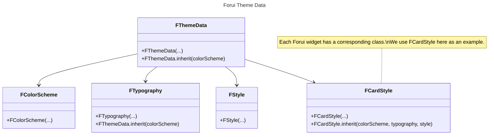

import {Callout} from "nextra/components";

export function Theme({title, color}) {
    return (
        <div className="flex items-center space-x-2">
            <div className="h-4 w-4 rounded-full" style={{backgroundColor: color}}/>
            <p className="font-medium">{title}</p>
        </div>
    );
}


# Themes

Forui themes allows you to customize the look and feel of your Flutter application.
Our theming solution is designed to help you get started quickly while offering powerful and flexible customization options.


## Predefined Themes

<Callout type="info">
    Forui does not manage the theme brightness (light or dark) automatically.
    You need to specify the theme explicitly in `FTheme(...)`.

    ```dart filename="main.dart" {3} copy
    @override
    Widget build(BuildContext context) => FTheme(
          data: FThemes.zinc.light, // or FThemes.zinc.dark
          child: const FScaffold(...),
        );
    ```
</Callout>

Forui provides a set of predefined themes that you can use out of the box.
The color schemes are heavily inspired by [shadcn/ui themes](https://ui.shadcn.com/themes).

| Theme                                    | Light Accessor         | Dark Accessor         |
|:-----------------------------------------|:-----------------------|:----------------------|
| <Theme title="Zinc" color="#18181b" />   | `FThemes.zinc.light`   | `FThemes.zinc.dark`   |
| <Theme title="Slate" color="#64748b" />  | `FThemes.slate.light`  | `FThemes.slate.dark`  |
| <Theme title="Red" color="#dc2626" />    | `FThemes.red.light`    | `FThemes.red.dark`    |
| <Theme title="Rose" color="#e11d48" />   | `FThemes.rose.light`   | `FThemes.rose.dark`   |
| <Theme title="Orange" color="#f97316" /> | `FThemes.orange.light` | `FThemes.orange.dark` |
| <Theme title="Green" color="#16a34a" />  | `FThemes.green.light`  | `FThemes.green.dark`  |
| <Theme title="Blue" color="#2563eb" />   | `FThemes.blue.light`   | `FThemes.blue.dark`   |
| <Theme title="Yellow" color="#facc15" /> | `FThemes.yellow.light` | `FThemes.yellow.dark` |
| <Theme title="Violet" color="#7c3aed" /> | `FThemes.violet.light` | `FThemes.violet.dark` |


## Usage

[`FTheme`](https://pub.dev/documentation/forui/latest/forui.theme/FTheme-class.html) uses inherited widgets to provide the
[`FThemeData`](https://pub.dev/documentation/forui/latest/forui.theme/FThemeData-class.html) to all widgets in the subtree.
Forui provides an extension on `BuildContext` which allows for direct access to `FThemeData` through `context.theme`.

```dart {3-6} copy
@override
Widget build(BuildContext context) {
  final theme = context.theme; // FThemeData
  final colorScheme = context.theme.colorScheme; // FColorScheme
  final typography = context.theme.typography; // FTypography
  final style = context.theme.style; // FStyle

  return const Placeholder();
}
```

A high level overview of the theme data structure is as follows:
- [**`FThemeData`**](https://pub.dev/documentation/forui/latest/forui.theme/FThemeData-class.html) contains `FColorScheme`, `FTypography`, `FStyle`, and widget styles (eg. `FCardStyle`).
- [**`FColorScheme`**](https://pub.dev/documentation/forui/latest/forui.theme/FColorScheme-class.html) contains the color scheme (eg. `background`, `foreground`, and `primary`).
- [**`FTypography`**](https://pub.dev/documentation/forui/latest/forui.theme/FTypography-class.html) contains the `defaultFontFamily` and various `TextStyle`s.
- [**`FStyle`**](https://pub.dev/documentation/forui/latest/forui.theme/FStyle-class.html) contains other miscellaneous styling options (eg. `borderRadius`).

A more detailed explanation of each class can be found in the [Class Diagram](#class-diagram) section.


## Customize Themes

It's recommended to use the predefined themes as a starting point and customize them with the
[`inherit(...)`](https://pub.dev/documentation/forui/latest/forui.theme/FThemeData/FThemeData.inherit.html) constructor
and [`copyWith(...)`](https://pub.dev/documentation/forui/latest/forui.theme/FThemeData/copyWith.html) method to suit your needs.

```dart filename="main.dart" {3-14, 17-23} copy
@override
Widget build(BuildContext context) {
  final theme = FThemeData.inherit(
    colorScheme: FThemes.zinc.light.colorScheme.copyWith(
      primary: const Color(0xFF0D47A1), // dark blue
      primaryForeground: const Color(0xFFFFFFFF), // white
    ),
    typography: FThemes.zinc.light.typography.copyWith(
      defaultFontFamily: 'Roboto',
    ).scale(sizeScalar: 0.8),
    style: FThemes.zinc.light.style.copyWith(
      borderRadius: BorderRadius.zero,
    ),
  );

  return FTheme(
    data: theme.copyWith(
      cardStyle: theme.cardStyle.copyWith(
        decoration: theme.cardStyle.decoration.copyWith(
          borderRadius: const BorderRadius.all(Radius.circular(8)),
        ),
      ),
    ),
    child: const FScaffold(...),
  );
}
```

The example above uses `FThemes.zinc.light` theme as a starting point and customizes the following:

- Update the `primary` and `primaryForeground` colors.
- Change the default font family to `Roboto` and scale the font size by `2`.
- Remove the `borderRadius` through the style.
- Although we removed the `borderRadius` for all widgets, override the `borderRadius` to `8` for the `FCard()` widget.

<Callout type="warning">
    It's important to use the newly created `theme` instead of `FThemes.zinc.light`. This allows `colorScheme`,
    `typography`, and `style` to be inherited by widget-specific themes.

    ```dart {3-4} copy
    return FTheme(
      data: theme.copyWith(
        cardStyle: theme.cardStyle.copyWith(
          decoration: theme.cardStyle.decoration.copyWith(
            borderRadius: const BorderRadius.all(Radius.circular(8)),
          ),
        ),
      ),
      child: const FScaffold(...),
    );
    ```
</Callout>

While the example may seem overwhelming, most use cases will only require customizations to the `FColorScheme`, `FTypography`, and `FStyle` class.
Sensible defaults for each Forui widget will be automatically inherited.


## Class Diagram




### Color Scheme

The `FColorScheme` class contains the color scheme for the theme.
This usually consist of a set of colors with its corresponding foreground color (eg. `primary` and `primaryForeground`).

In most cases, the color will be used as the background color, and the foreground color will be used as the text/icon color.

```dart {3, 6-14} copy
@override
Widget build(BuildContext context) {
  final colorScheme = context.theme.colorScheme;
  final typography = context.theme.typography;

  return ColoredBox(
    color: colorScheme.primary,
    child: Text(
      'Hello World!',
      style: typography.xs.copyWith(
          color: colorScheme.primaryForeground
      ),
    ),
  );
}
```

#### Hovered and Disabled Colors

Hovered and disabled colors are derived by adjusting the opacity. To derive these colors, use the `FColorScheme.hover`
and `FColorScheme.disable` methods. The opacity can be adjusted with `FColorScheme.enabledHoveredOpacity` and
`FColorScheme.disabledOpacity`.

### Typography

The `FTypography` class contains the typography settings for the theme.
This includes the default font family and various `TextStyle`s for different use cases.

<Callout type="info">
    The `TextStyle`s stored in `FTypography` are based on [Tailwind CSS Font Size](https://tailwindcss.com/docs/font-size).
    For instance, `FTypography.sm` is closely related to `text-sm` in Tailwind CSS.
</Callout>

It is recommended to use the `copyWith(...)` to apply colors and other styles as the `TextStyle`s stored only contain the `fontSize` and `height` properties.

```dart {4, 8-12} copy
@override
Widget build(BuildContext context) {
  final colorScheme = context.theme.colorScheme;
  final typography = context.theme.typography;

  return Text(
    'Hello World!',
    style: typography.xs.copyWith(
      color: colorScheme.primaryForeground,
      fontWeight: FontWeight.bold,
      fontStyle: FontStyle.italic,
    ),
  );
}
```


#### Custom Font Family

To change the default font family, use the `copyWith(...)` method to apply the new font family.
As some fonts may have different sizes, the `scale(...)` method is provided to quickly scale all the font sizes.

```dart filename="main.dart" {4-6} copy
@override
Widget build(BuildContext context) => FTheme(
      data: FThemes.zinc.light.copyWith(
        typography: FThemes.zinc.light.typography.copyWith(
          defaultFontFamily: 'Roboto',
        ).scale(sizeScalar: 0.8),
      ),
      child: const FScaffold(...),
    );
```


### Style

The `FStyle` class contains other miscellaneous styling options for the theme.

```dart {4, 7-14} copy
@override
Widget build(BuildContext context) {
  final colorScheme = context.theme.colorScheme;
  final style = context.theme.style;

  return DecoratedBox(
    decoration: BoxDecoration(
      border: Border.all(
        color: colorScheme.border,
        width: style.borderWidth,
      ),
      borderRadius: style.borderRadius,
      color: colorScheme.primary,
    ),
    child: const Placeholder(),
  );
}
```


## Override Individual Widgets

In certain cases, you may want to override the theme for a specific widget.
This can be easily achieved by using the `style(...)` parameter.

<Callout type="info">
    In the example below, styles are only overridden for this specific `FCard` widget.
    `FCard` widgets that are used elsewhere will still inherit from theme data.
</Callout>

```dart filename="main.dart" {8-12} copy
@override
Widget build(BuildContext context) {
  final theme = context.theme;

  return FCard(
    title: 'Notification',
    subtitle: 'You have 3 new messages',
    style: theme.cardStyle.copyWith(
      decoration: theme.cardStyle.decoration.copyWith(
        borderRadius: BorderRadius.zero, // Remove border radius.
      ),
    ),
  );
}
```
